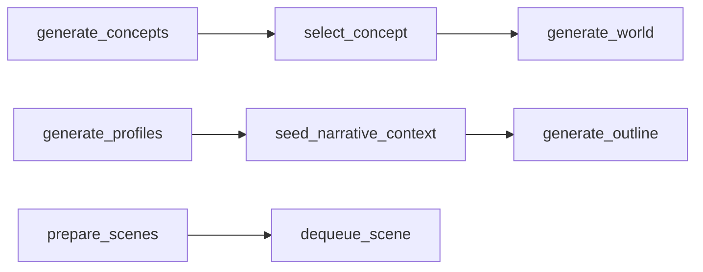
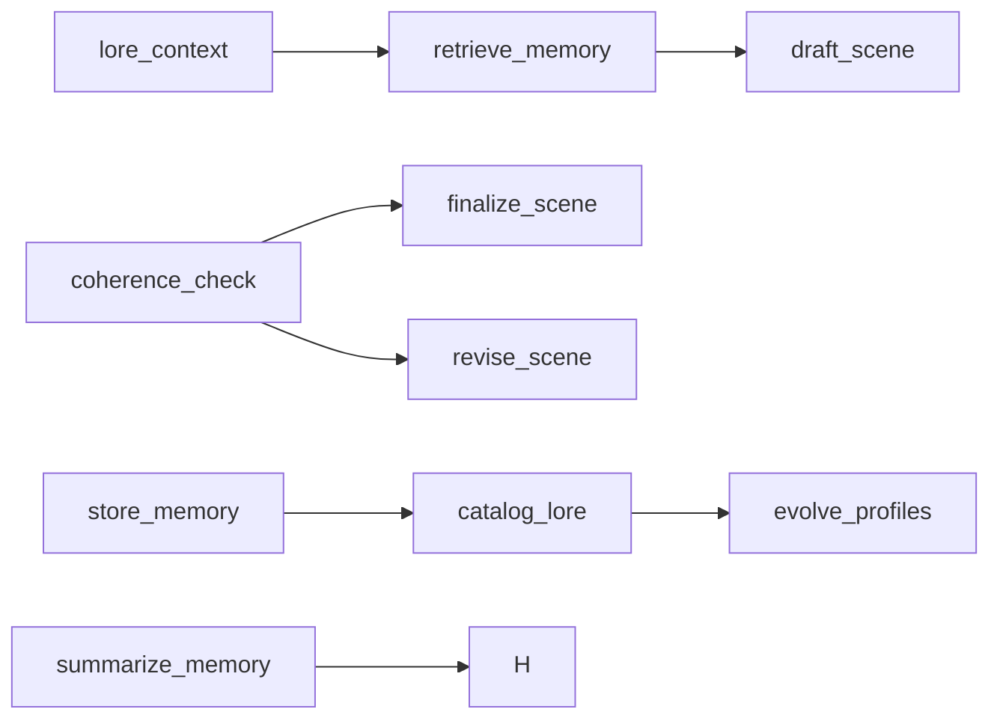

# Chorus-Lite System Patterns

## Architectural Patterns

### Layered Architecture
The system follows a clean layered architecture with well-defined responsibilities:

1. **Interface Layer** (Web UI & API)
   - FastAPI endpoints
   - WebSocket for real-time updates
   - Jinja2 templates for HTML rendering

2. **Orchestration Layer** (LangGraph)
   - Workflow management
   - State tracking through `StoryState`
   - Error recovery strategies

3. **Agent Layer** (Three core agents)
   - **StoryArchitect**: High-level planning and world-building
   - **SceneGenerator**: Scene writing and revision
   - **IntegrationManager**: Story integration and finalization

4. **Persistence Layer** (PostgreSQL with pgvector)
   - Canonical storage for story data
   - Custom enum types (`scene_status_enum`)
   - UUID primary keys for all tables

5. **Core Layer** (Utilities)
   - Async-first I/O operations
   - Pydantic models for validation
   - Structured logging with WebSocket streaming

### Agent Communication Pattern
Agents communicate through a structured message passing system:
- All agents inherit from `Agent` base class
- Shared database connection management
- Task queue operations via `queue.py`
- Scene status management
- Inter-agent communication through `communication.py`

### Workflow Management Pattern
LangGraph workflow uses modular subgraphs with clear responsibilities:

**Story Setup Subgraph**


**Revision Loop Subgraph**


### Error Handling Pattern
Comprehensive error recovery strategy implemented using:
- **Retry with Exponential Backoff**: Automatic retries for transient errors
- **Circuit Breaker Pattern**: Prevent cascading failures
- **Fault Isolation**: Isolate failing components
- **State Rollback**: Restore to previous valid state
- **Manual Intervention**: Escalate to human review

### Memory Management Pattern
In-memory context management with:
- Text embeddings for similarity search
- Caching strategy (1-hour TTL for world generation, 30-min for character profiles)
- Scene memory storage and retrieval
- Memory summarization utilities

## Technical Patterns

### Async-First Pattern
All I/O operations use async/await:
```python
async def generate_scene(self, scene_brief: SceneBrief):
    # Async database operations
    # Async LLM calls
    # Async WebSocket notifications
```

### Structured Output Pattern
Pydantic models enforce data validation throughout:
```python
class SceneBrief(BaseModel):
    title: str
    description: str
    characters: list[str]
    setting: str
```

### State Management Pattern
LangGraph state uses TypedDict for workflow tracking:
```python
class StoryState(TypedDict, total=False):
    vision: Concept
    world_info: list[WorldAnvil]
    character_profiles: list[CharacterProfile]
    current_scene_id: str
    scene_briefs: list[SceneBrief]
```

### Configuration Pattern
Pydantic-based configuration with environment variables:
```python
class ChorusConfig(BaseModel):
    database: DatabaseConfig
    llm: LLMConfig
    embedding: EmbeddingConfig
    agents: AgentModelConfig
    system: SystemConfig
```

## Critical Design Decisions

1. **Three-Agent Architecture**: 
   - Simplified from original four-agent design
   - Each agent has a clear, focused responsibility
   - Reduced complexity while maintaining full functionality

2. **LangGraph for Workflow Management**:
   - Provides built-in state management
   - Enables clear workflow visualization
   - Supports robust error recovery

3. **PostgreSQL with pgvector**:
   - Efficient storage of structured story data
   - Vector search for memory retrieval
   - Robust transactional support

4. **Async-First Development**:
   - Improved performance for I/O-bound operations
   - Better resource utilization
   - Future-proofing for scaling

5. **Structured Logging with WebSocket Streaming**:
   - Real-time monitoring of story generation
   - Comprehensive error tracking
   - Enhanced debugging capabilities
